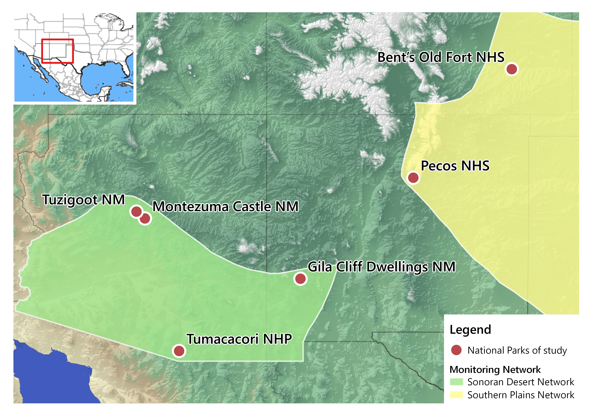

# General information

The dataset is the result of long-term aquatic macroinvertebrates sampling performed by the National Park Service in national parks of Southwestern US throughout 2008-2024. This database is in wide format and has information about taxa abundance by sample, with multiple samples taken from each park each year. For my project, I am focusing in streams of 6 parks and samples from 2012-2022.



# Goals

1.  Clean up the data to keep only 6 parks:
    -   Bent's Old Fort National Historic Site, Colorado (unit code: BEOL)
    -   Gila Cliff Dwellings National Monument, New Mexico (GICL)
    -   Montezuma Castle National Monument, Arizona (two sub-units: MOCC, MOWE)
    -   Pecos National Historical Park, New Mexico (PECO)
    -   Tumacácori National Historical Park, Arizona (TUMM)
    -   Tuzigoot National Monument, Arizona (TUZI)
2.  Keep years 2012-2022
3.  Rename columns
4.  Transform to long-format
5.  Join with taxonomy database
6.  Plot richness and relative abundance

# Set-Up

Loading necessary libraries:

```{r}
library(cowplot) # theme for ggplot
library(tidyverse)
```

Loading data:

```{r}
full_data <- read_csv("../data_raw/full-invert-matrix-v3.csv")

full_taxa <- read_csv("../data_raw/full-taxonomy.csv")
```

# Cleaning data

Renaming columns with `rename()` (**Week 06**), and extracting the year from the date of sampling using `lubridate` and `mutate()` (**Week 03**, **Week 07**).

```{r}
data_0 <- full_data %>% 
  rename(sample = Sample, 
         site = Site, 
         park = Park, 
         state = State, 
         network = Network, 
         date = Date, 
         habitat = Habitat) %>%  # renaming sample information columns
  mutate(date = ymd(date),
         year = year(date)) 

head(data_0[ , c(1:9)]) # showing first rows of first 9 columns
```

Filtering data to keep only 6 parks, streams (Riffle and Multiple habitat) and years 2012-2022 with `filter()`. Selecting sample information columns and all taxa columns for later use with `select()` (Week 03). Using base R subsetting to clean taxa columns with no counts (**Week 02**).

```{r}
data_0 <- data_0 %>%
  filter(park == "BEOL" | park == "GICL" | park == "MOCA" | 
         park == "PECO" | park == "TUMM" | park == "TUZI",
	  year > 2011 & year < 2023, habitat != "Spring") %>% # excluding springs 
  select(sample, park, site, year, habitat, Abedus:Zygoptera)

data_0 <- data_0[ , colSums(data_0 != 0) > 0] # remove taxa with no counts

head(data_0[ , c(1:7)]) # showing first rows of first 7 columns
```

## *Review:*

```{r}
#Obviously you used base R to be able to use skills from week 2 but another way to do it in tidyverse could have been 

#select(where(~ !is.numeric(.) || sum(.) > 0))

#And then you could have added this directly into your pipe 
```

Transforming to long-format (Week 06).

```{r}
taxa_long <- data_0 %>% 
  pivot_longer(cols = 6:length(data_0), # taxa columns
               names_to = "Taxa", # capitalized for join
               values_to = "rel_abundance") %>%
  filter(rel_abundance != 0) # removing rows with no abundances

head(taxa_long)
```

Joining long format data with `full_taxa` using `left_join()` (**Week 04**).

```{r}
taxa_join <- left_join(taxa_long, full_taxa, join_by(Taxa))

head(taxa_join)
```

Cleaning up new data frame.

```{r}
all_taxa <- taxa_join %>% 
  group_by(site, year) %>% 
  # recalculating abundance relative to sample size
  mutate(rel_ab_recalc = rel_abundance/sum(rel_abundance)) %>%  
  group_by(site, year, Taxa) %>% 
  # adding up all abundances of each taxa in each sample
  mutate(rel_ab_recalc = sum(rel_ab_recalc)) %>% 
  group_by(site, year) %>%
  # remove duplicate Taxa in each sample
  distinct(Taxa, .keep_all = T) %>% 
  ungroup() %>%
  select(sample, site, year, habitat, Class, Order, Taxa, rel_ab_recalc) %>%
  rename(class = Class, order = Order, taxa = Taxa) %>%
  arrange(site, year) # sorting data

# exporting long-format data
write_csv(all_taxa, file = "../data_clean/invert_long_clean.csv")

head(all_taxa)
```

## *Review*:

```{r}
#The above code is great! Very well orgaized, and accomplished exactly what you want. A potential alternative way to go about it is what I'll put below. I don't think either is better. The biggest thing I have changed is not having to mutate so many times.

# all_taxa <- taxa_join %>%
#   group_by(site, year, Taxa) %>%
#   summarise(
#     rel_ab_recalc = sum(rel_abundance) / sum(rel_abundance, na.rm = TRUE), 
#     sample = first(sample),
#     habitat = first(habitat),
#     Class = first(Class),
#     Order = first(Order),
#     .groups = "drop"
#   ) %>%
#   select(sample, site, year, habitat, Class, Order, Taxa, rel_ab_recalc) %>%
#   rename(class = Class, order = Order, taxa = Taxa) %>%
#   arrange(site, year)
```

# Analysis and plotting

Creating color palette.

```{r}
col_sites <- c( # custom color palette for sites
  "BEOL" = "#CC79A7",
  "GICL" = "#D55E00",
  "MOCC" = "#E69F00",
  "MOWE" = "#F0E442",
  "PECO" = "#009E73",
  "TUMM" = "#56B4E9",
  "TUZI" = "#0072B2")
```

Plotting number of samples by site using `ggplot` (**Week 05**).

```{r}
ggplot(data_0, aes(x = year)) +
  geom_histogram(aes(fill = site), bins = 10, color = "#ffffff70") +
  facet_wrap(~ site) +
  labs(y = "Number of samples", x = "Year") +
  scale_y_continuous(breaks = seq(0, 4, 1)) +
  scale_x_continuous(breaks = seq(2012, 2022, 3)) +
  scale_fill_manual(values = col_sites) + # use custom palette
  theme_cowplot() +
  background_grid() +
  guides(fill = "none") # remove sites from legend
```

## *Review:*

```{r}
#Love the above graphs and the colors. I think another fun one that could have given a similar picture of what you were trying to express (although I think you method is probably better) would have been to plot the abundnace of samples per year and overlaying the differnt site colors all on one graph. 

```

## Total taxonomic richness

```{r}
# counting unique taxa in "taxa" column
paste("Total richness:", length(unique(all_taxa$taxa))) 
```

## *Review:*

```{r}
#Here is two other possible ways of doing the same thing:

#paste("Total richness:", n_distinct(all_taxa$taxa))

#all_taxa %>%
  # summarise(total_richness = n_distinct(taxa)) %>%
  # pull() %>%
  # paste("Total richness:", .)
```

## Richness by site

```{r}
richness_total <- all_taxa %>% 
  select(site, taxa) %>% 
  group_by(site) %>% 
  arrange(site, taxa) %>% # reorder taxa alphabetically (exploratory)
  distinct(taxa) %>% # keeping only unique taxa by site
  summarize(rich_site = n()) # calculate total richness by site

# plot richness by site
ggplot(richness_total, aes(x = site, y = rich_site, fill = site)) +
  geom_col(width = 0.7) +
  # richness value above bars
  geom_text(aes(site, rich_site, label = rich_site), vjust = -0.5) +
  labs(x = "Site",
       y = "Taxonomic richness") +
  scale_fill_manual(values = col_sites) +
  theme_cowplot() +
  guides(fill = "none") # remove site from legend
```

## Richness by year

```{r}
richness_year <- all_taxa %>% 
  select(site, year, taxa) %>% 
  group_by(site, year) %>% 
  summarize(richness = n()) %>% # calculate richness by year
  ungroup()

# plot richness by year
richness_year_plot <- ggplot(richness_year, aes(x = year, y = richness, color = site)) +
  geom_point(size = 4) +
  geom_line(linetype = 2, linewidth = 1) +
  scale_color_manual(values = col_sites) +
  scale_x_continuous(breaks = seq(2012, 2022, by = 1)) +
  labs(x = "Year", y = "Taxonomic richness", color = "Site") +
  theme_cowplot() +
  background_grid()

# save plot
ggsave('../plots/richness_year.png', plot = richness_year_plot, 
       width = 9, height = 6, dpi = 300)

richness_year_plot
```

## *Review:*

```{r}
# The plot looks great! Consider also useing facet_wrap() to split up the diffent sites. I could see some people seeing the combined one you made as jumbled. You could also then more easily put something like a trend line showing the mean abundance over time

```

## Coefficient of variation

Creating function for coefficient of variation of taxonomic richness by site (**Week 11**).

```{r cv-richness}
cv <- function(x){
  # calculate x's coefficient of variation:
  (sd(x)/mean(x))*100
}

richness_year %>% 
  group_by(site) %>% 
  summarise(cv = cv(richness)) %>% 
  arrange(desc(cv))
```

## Relative abundance

Creating a function for relative abundance plots for each site (Week 11) and a color palette.

```{r}
# colors for each taxa
order_color <- c(
  "Amphipoda" = "#A6761D",
  #"Annelida" = "#b15928",
  "Basommatophora" = "#800000",
  "Bivalvia" = "#e31a1c",
  "Clitellata" = "#D95F02",
  "Coleoptera" = "#ff7f00",
  "Collembola" = "#fc8d62",
  "Decapoda" = "#fdbf6f",
  "Diptera" = "#ffe119",
  "Ephemeroptera" = "#B2DF8A",
  "Hemiptera" = "#a6d854",
  "Lepidoptera" = "#33A02C",
  "Megaloptera" = "#66c2a5",
  "Nematoda" = "#62b6e6",
  #"Neotaenioglossa" = "#4363d8",
  "Odonata" = "#000075",
  "Platyhelminthes" = "#7570B3",
  "Plecoptera" = "#6a3d9a",
  "Trichoptera" = "#cab2d6",
  "Trombidiformes" = "#cd7eaa",
  "Veneroida" = "#E7298A",
  "Xenacoelomorpha" = "#fb9a99")


# function for relative abundance plots by site
rel_abundance_plot <- function(data, site_name){
  ggplot(data %>% filter(site == site_name), 
         aes(x = year, y = rel_ab_recalc, fill = order)) +
    geom_bar(stat = "identity", 
             color = "#ffffff30") + # low alpha color to separate species within orders
    labs(title = site_name, 
         x = NULL, y = "Relative abundance", fill = "Taxa") +
    scale_x_continuous(breaks = seq(2012, 2022, 1)) +
    scale_y_continuous(breaks = seq(0, 1, 0.2)) +
    scale_fill_manual("Taxa", values = order_color) +
    expand_limits(x = c(2011.5, 2022.5)) +
    theme_cowplot() +
    theme(axis.text.x = element_text(size = rel(0.75))) # smaller x-axis text
}
```

### Bent's Old Fort National Historic Site

```{r rel-ab-plot-beol}
beol_plot <- rel_abundance_plot(all_taxa, "BEOL")
# save plot
ggsave('../plots/rel_ab_beol.png', plot = beol_plot, 
       width = 9, height = 6, dpi = 300)

beol_plot 
```

### Gila Cliff Dwellings National Monument

```{r rel-ab-plot-gicl}
gicl_plot <- rel_abundance_plot(all_taxa, "GICL")
# save plot
ggsave('../plots/rel_ab_gicl.png', plot = gicl_plot, 
       width = 9, height = 6, dpi = 300)

gicl_plot 
```

### Montezuma Castle National Monument, sub-unit 1

```{r rel-ab-plot-mocc}
mocc_plot <- rel_abundance_plot(all_taxa, "MOCC")
# save plot
ggsave('../plots/rel_ab_mocc.png', plot = mocc_plot, 
       width = 9, height = 6, dpi = 300)

mocc_plot
```

### Montezuma Castle National Monument, sub-unit 2

```{r rel-ab-plot-mowe}
mowe_plot <- rel_abundance_plot(all_taxa, "MOWE")
# save plot
ggsave('../plots/rel_ab_mowe.png', plot = mowe_plot, 
       width = 9, height = 6, dpi = 300)

mowe_plot
```

### Pecos National Historical Park

```{r rel-ab-plot-peco}
peco_plot <- rel_abundance_plot(all_taxa, "PECO")
# save plot
ggsave('../plots/rel_ab_peco.png', plot = peco_plot, 
       width = 9, height = 6, dpi = 300)

peco_plot
```

### Tumacácori National Historical Park

```{r rel-ab-plot-tumm}
tumm_plot <- rel_abundance_plot(all_taxa, "TUMM")
# save plot
ggsave('../plots/rel_ab_tumm.png', plot = tumm_plot, 
       width = 9, height = 6, dpi = 300)

tumm_plot
```

### Tuzigoot National Monument

```{r rel-ab-plot-tuzi}
tuzi_plot <- rel_abundance_plot(all_taxa, "TUZI")
# save plot
ggsave('../plots/rel_ab_tuzi.png', plot = tuzi_plot, 
       width = 9, height = 6, dpi = 300)

tuzi_plot
```

## Review:

```{r}
#I think it would be worth putting a more descriptive title for each one of your final plots for each park. Writing out the full name and then what the graph is showing. So even just "The Relative abundance of aquatic macroinvertebrates at  Tumacácori National Historical Park". This way each graph stands on its own. Alternatively, if your put all these graphs up next to eachotehr, lets say on a poster, you could make one overarching title and then leave the full names of the parks above each. 
```

## Review:

```{r}
#I know this was outside of the scope of your project but I would be curious to know the time of the year that different taxa or species were sampled. Looking at differnces between months betwee years could give a very intersting picture each parks ecosystems as well as compare diversty at differnt landscape level covariates like elevation and percipitation. With the code you already have written it would not be hard to integrate this considering in the origial data set you habe the exact date of collection.
```

## *Review:*

```{r}
#Overall this entire script is really well done. It is so clear and concise. I was easily able to follow it and I felt like you almost always took the most efficient path to get everthig done. I loved your graphs and the way they looked. I feel like if you were to present these finding at a talk or on a posted they would pop and the audience would have no trouble understanding them. 
```
