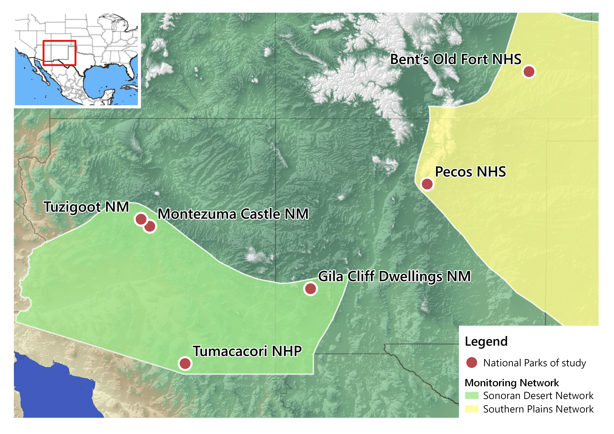

Data Wrangling 596 - Final Project
================
Rocío Guzmán
2025-05-06

# General information

The dataset is the result of long-term aquatic macroinvertebrates
sampling performed by the National Park Service in national parks of
Southwestern US throughout 2008-2024. This database is in wide format
and has information about taxa abundance by sample, with multiple
samples taken from each park each year. For my project, I am focusing in
streams of 6 parks and samples from 2012-2022.



# Goals

1.  Clean up the data to keep only 6 parks:
    - Bent’s Old Fort National Historic Site, Colorado (unit code: BEOL)
    - Gila Cliff Dwellings National Monument, New Mexico (GICL)
    - Montezuma Castle National Monument, Arizona (two sub-units: MOCC,
      MOWE)
    - Pecos National Historical Park, New Mexico (PECO)
    - Tumacácori National Historical Park, Arizona (TUMM)
    - Tuzigoot National Monument, Arizona (TUZI)
2.  Keep years 2012-2022
3.  Rename columns
4.  Transform to long-format
5.  Join with taxonomy database
6.  Plot richness and relative abundance

# Set-Up

Loading necessary libraries:

``` r
library(cowplot) # theme for ggplot
library(tidyverse)
```

    ## ── Attaching core tidyverse packages ──────────────────────── tidyverse 2.0.0 ──
    ## ✔ dplyr     1.1.4     ✔ readr     2.1.5
    ## ✔ forcats   1.0.0     ✔ stringr   1.5.1
    ## ✔ ggplot2   3.5.2     ✔ tibble    3.2.1
    ## ✔ lubridate 1.9.4     ✔ tidyr     1.3.1
    ## ✔ purrr     1.0.4     
    ## ── Conflicts ────────────────────────────────────────── tidyverse_conflicts() ──
    ## ✖ dplyr::filter()    masks stats::filter()
    ## ✖ dplyr::lag()       masks stats::lag()
    ## ✖ lubridate::stamp() masks cowplot::stamp()
    ## ℹ Use the conflicted package (<http://conflicted.r-lib.org/>) to force all conflicts to become errors

Loading data:

``` r
full_data <- read_csv("../data_raw/full-invert-matrix-v3.csv")
```

    ## Rows: 262 Columns: 300
    ## ── Column specification ────────────────────────────────────────────────────────
    ## Delimiter: ","
    ## chr    (6): Sample, Site, Park, State, Network, Habitat
    ## dbl  (293): Abedus, Acentrella, Aedes, Aeshnidae, Agabus, Allognosta, Ambrys...
    ## date   (1): Date
    ## 
    ## ℹ Use `spec()` to retrieve the full column specification for this data.
    ## ℹ Specify the column types or set `show_col_types = FALSE` to quiet this message.

``` r
full_taxa <- read_csv("../data_raw/full-taxonomy.csv")
```

    ## Rows: 269 Columns: 6
    ## ── Column specification ────────────────────────────────────────────────────────
    ## Delimiter: ","
    ## chr (6): Phylum, Class, Order, Family, ScientificName, Taxa
    ## 
    ## ℹ Use `spec()` to retrieve the full column specification for this data.
    ## ℹ Specify the column types or set `show_col_types = FALSE` to quiet this message.

# Cleaning data

Renaming columns with `rename()` (**Week 06**), and extracting the year
from the date of sampling using `lubridate` and `mutate()` (**Week 03**,
**Week 07**).

``` r
data_0 <- full_data %>% 
  rename(sample = Sample, 
         site = Site, 
         park = Park, 
         state = State, 
         network = Network, 
         date = Date, 
         habitat = Habitat) %>%  # renaming sample information columns
  mutate(date = ymd(date),
         year = year(date)) 

head(data_0[ , c(1:9)]) # showing first rows of first 9 columns
```

    ## # A tibble: 6 × 9
    ##   sample          site  park  state network date       habitat Abedus Acentrella
    ##   <chr>           <chr> <chr> <chr> <chr>   <date>     <chr>    <dbl>      <dbl>
    ## 1 GICL_2008-06-1… GICL  GICL  NM    SODN    2008-06-10 Riffle       0    0.00321
    ## 2 GICL_2008-06-1… GICL  GICL  NM    SODN    2008-06-10 Multip…      0    0.0122 
    ## 3 MOCA_2008-06-0… MOCC  MOCA  AZ    SODN    2008-06-03 Multip…      0    0      
    ## 4 MOWE_2008-06-0… MOWE  MOCA  AZ    SODN    2008-06-04 Riffle       0    0.00380
    ## 5 MOWE_2008-06-0… MOWE  MOCA  AZ    SODN    2008-06-04 Multip…      0    0      
    ## 6 TUZI_2008-06-0… TUZI  TUZI  AZ    SODN    2008-06-04 Riffle       0    0

Filtering data to keep only 6 parks, streams (Riffle and Multiple
habitat) and years 2012-2022 with `filter()`. Selecting sample
information columns and all taxa columns for later use with `select()`
(Week 03). Using base R subsetting to clean taxa columns with no counts
(**Week 02**).

``` r
data_0 <- data_0 %>%
  filter(park == "BEOL" | park == "GICL" | park == "MOCA" | 
         park == "PECO" | park == "TUMM" | park == "TUZI",
      year > 2011 & year < 2023, habitat != "Spring") %>% # excluding springs 
  select(sample, park, site, year, habitat, Abedus:Zygoptera)

data_0 <- data_0[ , colSums(data_0 != 0) > 0] # remove taxa with no counts

head(data_0[ , c(1:7)]) # showing first rows of first 7 columns
```

    ## # A tibble: 6 × 7
    ##   sample            park  site   year habitat  Abedus Acentrella
    ##   <chr>             <chr> <chr> <dbl> <chr>     <dbl>      <dbl>
    ## 1 TUMM_2012-05-08_r TUMM  TUMM   2012 Riffle        0    0      
    ## 2 TUMM_2012-05-08_m TUMM  TUMM   2012 Multiple      0    0      
    ## 3 MOCC_2012-05-21_r MOCA  MOCC   2012 Riffle        0    0.00177
    ## 4 MOCC_2012-05-21_m MOCA  MOCC   2012 Multiple      0    0      
    ## 5 MOWE_2012-05-22_r MOCA  MOWE   2012 Riffle        0    0.0155 
    ## 6 MOWE_2012-05-22_m MOCA  MOWE   2012 Multiple      0    0

Transforming to long-format (Week 06).

``` r
taxa_long <- data_0 %>% 
  pivot_longer(cols = 6:length(data_0), # taxa columns
               names_to = "Taxa", # capitalized for join
               values_to = "rel_abundance") %>%
  filter(rel_abundance != 0) # removing rows with no abundances

head(taxa_long)
```

    ## # A tibble: 6 × 7
    ##   sample            park  site   year habitat Taxa            rel_abundance
    ##   <chr>             <chr> <chr> <dbl> <chr>   <chr>                   <dbl>
    ## 1 TUMM_2012-05-08_r TUMM  TUMM   2012 Riffle  Ceratopogonidae       0.0103 
    ## 2 TUMM_2012-05-08_r TUMM  TUMM   2012 Riffle  Chironomidae          0.0545 
    ## 3 TUMM_2012-05-08_r TUMM  TUMM   2012 Riffle  Chironominae          0.492  
    ## 4 TUMM_2012-05-08_r TUMM  TUMM   2012 Riffle  Collembola            0.00736
    ## 5 TUMM_2012-05-08_r TUMM  TUMM   2012 Riffle  Culicoides            0.0250 
    ## 6 TUMM_2012-05-08_r TUMM  TUMM   2012 Riffle  Dolichopodidae        0.00147

Joining long format data with `full_taxa` using `left_join()` (**Week
04**).

``` r
taxa_join <- left_join(taxa_long, full_taxa, join_by(Taxa))

head(taxa_join)
```

    ## # A tibble: 6 × 12
    ##   sample park  site   year habitat Taxa  rel_abundance Phylum Class Order Family
    ##   <chr>  <chr> <chr> <dbl> <chr>   <chr>         <dbl> <chr>  <chr> <chr> <chr> 
    ## 1 TUMM_… TUMM  TUMM   2012 Riffle  Cera…       0.0103  Arthr… Inse… Dipt… Cerat…
    ## 2 TUMM_… TUMM  TUMM   2012 Riffle  Chir…       0.0545  Arthr… Inse… Dipt… Chiro…
    ## 3 TUMM_… TUMM  TUMM   2012 Riffle  Chir…       0.492   Arthr… Inse… Dipt… Chiro…
    ## 4 TUMM_… TUMM  TUMM   2012 Riffle  Coll…       0.00736 Arthr… Coll… Coll… <NA>  
    ## 5 TUMM_… TUMM  TUMM   2012 Riffle  Culi…       0.0250  Arthr… Inse… Dipt… Cerat…
    ## 6 TUMM_… TUMM  TUMM   2012 Riffle  Doli…       0.00147 Arthr… Inse… Dipt… Dolic…
    ## # ℹ 1 more variable: ScientificName <chr>

Cleaning up new data frame.

``` r
all_taxa <- taxa_join %>% 
  group_by(site, year) %>% 
  # recalculating abundance relative to sample size
  mutate(rel_ab_recalc = rel_abundance/sum(rel_abundance)) %>%  
  group_by(site, year, Taxa) %>% 
  # adding up all abundances of each taxa in each sample
  mutate(rel_ab_recalc = sum(rel_ab_recalc)) %>% 
  group_by(site, year) %>%
  # remove duplicate Taxa in each sample
  distinct(Taxa, .keep_all = T) %>% 
  ungroup() %>%
  select(sample, site, year, habitat, Class, Order, Taxa, rel_ab_recalc) %>%
  rename(class = Class, order = Order, taxa = Taxa) %>%
  arrange(site, year) # sorting data

# exporting long-format data
write_csv(all_taxa, file = "../data_clean/invert_long_clean.csv")

head(all_taxa)
```

    ## # A tibble: 6 × 8
    ##   sample            site   year habitat  class        order  taxa  rel_ab_recalc
    ##   <chr>             <chr> <dbl> <chr>    <chr>        <chr>  <chr>         <dbl>
    ## 1 BEOL_2013-06-05_m BEOL   2013 Multiple Malacostraca Amphi… Amph…       0.00136
    ## 2 BEOL_2013-06-05_m BEOL   2013 Multiple Insecta      Odona… Argia       0.00355
    ## 3 BEOL_2013-06-05_m BEOL   2013 Multiple Insecta      Dipte… Cera…       0.0187 
    ## 4 BEOL_2013-06-05_m BEOL   2013 Multiple Insecta      Dipte… Chir…       0.122  
    ## 5 BEOL_2013-06-05_m BEOL   2013 Multiple Insecta      Dipte… Chir…       0.113  
    ## 6 BEOL_2013-06-05_m BEOL   2013 Multiple Insecta      Odona… Coen…       0.00432

# Analysis and plotting

Creating color palette.

``` r
col_sites <- c( # custom color palette for sites
  "BEOL" = "#CC79A7",
  "GICL" = "#D55E00",
  "MOCC" = "#E69F00",
  "MOWE" = "#F0E442",
  "PECO" = "#009E73",
  "TUMM" = "#56B4E9",
  "TUZI" = "#0072B2")
```

Plotting number of samples by site using `ggplot` (**Week 05**).

``` r
ggplot(data_0, aes(x = year)) +
  geom_histogram(aes(fill = site), bins = 10, color = "#ffffff70") +
  facet_wrap(~ site) +
  labs(y = "Number of samples", x = "Year") +
  scale_y_continuous(breaks = seq(0, 4, 1)) +
  scale_x_continuous(breaks = seq(2012, 2022, 3)) +
  scale_fill_manual(values = col_sites) + # use custom palette
  theme_cowplot() +
  background_grid() +
  guides(fill = "none") # remove sites from legend
```

<!-- -->

## Total taxonomic richness

``` r
# counting unique taxa in "taxa" column
paste("Total richness:", length(unique(all_taxa$taxa))) 
```

    ## [1] "Total richness: 243"

## Richness by site

``` r
richness_total <- all_taxa %>% 
  select(site, taxa) %>% 
  group_by(site) %>% 
  arrange(site, taxa) %>% # reorder taxa alphabetically (exploratory)
  distinct(taxa) %>% # keeping only unique taxa by site
  summarize(rich_site = n()) # calculate total richness by site

# plot richness by site
ggplot(richness_total, aes(x = site, y = rich_site, fill = site)) +
  geom_col(width = 0.7) +
  # richness value above bars
  geom_text(aes(site, rich_site, label = rich_site), vjust = -0.5) +
  labs(x = "Site",
       y = "Taxonomic richness") +
  scale_fill_manual(values = col_sites) +
  theme_cowplot() +
  guides(fill = "none") # remove site from legend
```

<!-- -->

## Richness by year

``` r
richness_year <- all_taxa %>% 
  select(site, year, taxa) %>% 
  group_by(site, year) %>% 
  summarize(richness = n()) %>% # calculate richness by year
  ungroup()
```

    ## `summarise()` has grouped output by 'site'. You can override using the
    ## `.groups` argument.

``` r
# plot richness by year
richness_year_plot <- ggplot(richness_year, aes(x = year, y = richness, color = site)) +
  geom_point(size = 4) +
  geom_line(linetype = 2, linewidth = 1) +
  scale_color_manual(values = col_sites) +
  scale_x_continuous(breaks = seq(2012, 2022, by = 1)) +
  labs(x = "Year", y = "Taxonomic richness", color = "Site") +
  theme_cowplot() +
  background_grid()

# save plot
ggsave('../plots/richness_year.png', plot = richness_year_plot, 
       width = 9, height = 6, dpi = 300)

richness_year_plot
```

<!-- -->

## Coefficient of variation

Creating function for coefficient of variation of taxonomic richness by
site (**Week 11**).

``` r
cv <- function(x){
  # calculate x's coefficient of variation:
  (sd(x)/mean(x))*100
}

richness_year %>% 
  group_by(site) %>% 
  summarise(cv = cv(richness)) %>% 
  arrange(desc(cv))
```

    ## # A tibble: 7 × 2
    ##   site     cv
    ##   <chr> <dbl>
    ## 1 BEOL   25.2
    ## 2 GICL   24.2
    ## 3 TUMM   19.7
    ## 4 PECO   18.1
    ## 5 MOCC   15.2
    ## 6 MOWE   14.1
    ## 7 TUZI   10.1

## Relative abundance

Creating a function for relative abundance plots for each site (Week 11)
and a color palette.

``` r
# colors for each taxa
order_color <- c(
  "Amphipoda" = "#A6761D",
  #"Annelida" = "#b15928",
  "Basommatophora" = "#800000",
  "Bivalvia" = "#e31a1c",
  "Clitellata" = "#D95F02",
  "Coleoptera" = "#ff7f00",
  "Collembola" = "#fc8d62",
  "Decapoda" = "#fdbf6f",
  "Diptera" = "#ffe119",
  "Ephemeroptera" = "#B2DF8A",
  "Hemiptera" = "#a6d854",
  "Lepidoptera" = "#33A02C",
  "Megaloptera" = "#66c2a5",
  "Nematoda" = "#62b6e6",
  #"Neotaenioglossa" = "#4363d8",
  "Odonata" = "#000075",
  "Platyhelminthes" = "#7570B3",
  "Plecoptera" = "#6a3d9a",
  "Trichoptera" = "#cab2d6",
  "Trombidiformes" = "#cd7eaa",
  "Veneroida" = "#E7298A",
  "Xenacoelomorpha" = "#fb9a99")


# function for relative abundance plots by site
rel_abundance_plot <- function(data, site_name){
  ggplot(data %>% filter(site == site_name), 
         aes(x = year, y = rel_ab_recalc, fill = order)) +
    geom_bar(stat = "identity", 
             color = "#ffffff30") + # low alpha color to separate species within orders
    labs(title = site_name, 
         x = NULL, y = "Relative abundance", fill = "Taxa") +
    scale_x_continuous(breaks = seq(2012, 2022, 1)) +
    scale_y_continuous(breaks = seq(0, 1, 0.2)) +
    scale_fill_manual("Taxa", values = order_color) +
    expand_limits(x = c(2011.5, 2022.5)) +
    theme_cowplot() +
    theme(axis.text.x = element_text(size = rel(0.75))) # smaller x-axis text
}
```

### Bent’s Old Fort National Historic Site

``` r
beol_plot <- rel_abundance_plot(all_taxa, "BEOL")
# save plot
ggsave('../plots/rel_ab_beol.png', plot = beol_plot, 
       width = 9, height = 6, dpi = 300)

beol_plot 
```

<!-- -->

### Gila Cliff Dwellings National Monument

``` r
gicl_plot <- rel_abundance_plot(all_taxa, "GICL")
# save plot
ggsave('../plots/rel_ab_gicl.png', plot = gicl_plot, 
       width = 9, height = 6, dpi = 300)

gicl_plot 
```

<!-- -->

### Montezuma Castle National Monument, sub-unit 1

``` r
mocc_plot <- rel_abundance_plot(all_taxa, "MOCC")
# save plot
ggsave('../plots/rel_ab_mocc.png', plot = mocc_plot, 
       width = 9, height = 6, dpi = 300)

mocc_plot
```

<!-- -->

### Montezuma Castle National Monument, sub-unit 2

``` r
mowe_plot <- rel_abundance_plot(all_taxa, "MOWE")
# save plot
ggsave('../plots/rel_ab_mowe.png', plot = mowe_plot, 
       width = 9, height = 6, dpi = 300)

mowe_plot
```

<!-- -->

### Pecos National Historical Park

``` r
peco_plot <- rel_abundance_plot(all_taxa, "PECO")
# save plot
ggsave('../plots/rel_ab_peco.png', plot = peco_plot, 
       width = 9, height = 6, dpi = 300)

peco_plot
```

<!-- -->

### Tumacácori National Historical Park

``` r
tumm_plot <- rel_abundance_plot(all_taxa, "TUMM")
# save plot
ggsave('../plots/rel_ab_tumm.png', plot = tumm_plot, 
       width = 9, height = 6, dpi = 300)

tumm_plot
```

<!-- -->

### Tuzigoot National Monument

``` r
tuzi_plot <- rel_abundance_plot(all_taxa, "TUZI")
# save plot
ggsave('../plots/rel_ab_tuzi.png', plot = tuzi_plot, 
       width = 9, height = 6, dpi = 300)

tuzi_plot
```

<!-- -->
